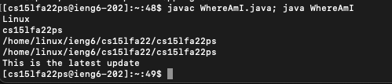

## **Hello! In this lab report we will cover remote access topics including...**

- downloading vscode
- remotely connecting to the ieng6 ucsd server
- using commands on the ieng6 remote server
- using sercure copy to move files to the remote directory
- using an SSH key rather than entering a password everytime
- optimization of remote server commands

## **Downloading Visual Studio Code**

- Download the proper version of vs code; for MacOS, follow this link [here](https://code.visualstudio.com/)
- Use the blue download button and follow installation instructions to move vs code into your applications folder

## **Connecting Remotely**

- Now, visit this link [here](https://sdacs.ucsd.edu/~icc/index.php) to view your UCSD server account information and reset your password if needed.
- Using the terminal, use the *ssh* command (secure shell) followed by cs15lfa22__@ieng6.ucsd.edu (__ will depend on your account ID)
- You will be prompted to continue (to which you can say yes) and follow up with your password from the account lookup to your cs15lfa22 account

The output should look something like this...

## **Using Commands**

- Now that you have successfully logged into the remote ieng6 server, you can try using a few commands to explore the directory.
- Some example commands to use might include *ls* to list the files, *mkdir* to make a new directory, etc.
- Below is an example of the commands I ran once I logged onto the server for the first time.

## **Secure Copying to the Server**
- Once comfortable with the remote Linux environment, you can work with the *scp* command to secure copy a file from your local directory to the server.
- Create a file that uses *System.getProperty* user information to explore where our current shell is located. Here is my program when run locally.

 

- Use *scp filename.java cs15lfa22__@ieng6.ucsd.edu:~/* to move a copy of your file to the server directory. Once you log in with ssh once again, you should be able to compile and run your file from the server (remotely).

## **SSH Key**
- To avoid the need for a password each time you access the server, we can use *ssh-keygen* to create a public (which is moved to the server) and private key (local) that allows you direct access (although you may add a passphrase if you wish to do so).
- Once entering *ssh-keygen* into the terminal, hit enter when prompted to enter the file in which to save the key and then enter your passphrase (optional). 
- Now use *ssh* to log back onto the server, make a directory of *.ssh* (unless you saved the key under something different), log out, and *scp* your **PUBLIC** key file *../id_rsa.pub* to the server directory you just created. You may now log in (with your optional passphrase) much quicker!

## **Optimization**
- To optimize the moving of a file to the server, you may run multiple commands separated by a semicolon ";".
- For example, you may wish to use a single line on the terminal to copy your file using *scp* while also logging onto the server via *ssh* and compiling and running your file remotely.
- If we don't count my passphrase keystrokes, I was able to move a file to the remote server, compile the file remotely, and run it remotely in 10 keystrokes (although I did use the up arrow to use prior commands).
- from the local directory use (where the __ represents your personal ID 2 letter code): 

$ scp WhereAmI.java cs15l22__@ieng6.ucsd.edu:~/; ssh cs15lfa22__@ieng6.ucsd.edu "javac WhereAmI.java; java WhereAmI"

## You are now able to efficiently log onto the remote ieng6 server and use it for storage, retrieval, and running of files in a remote Linux environment!
