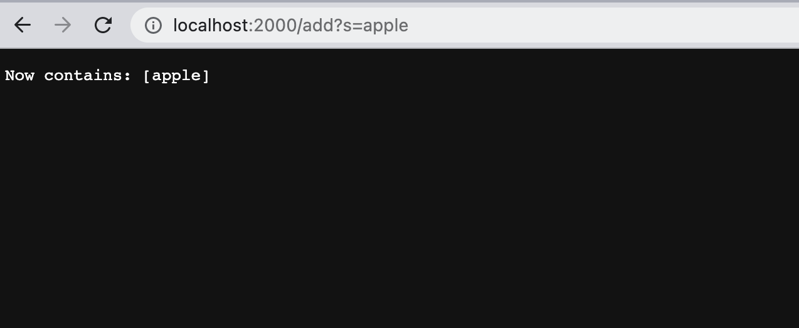
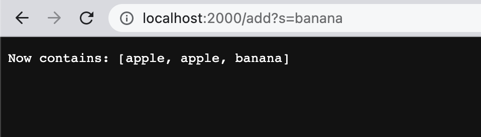
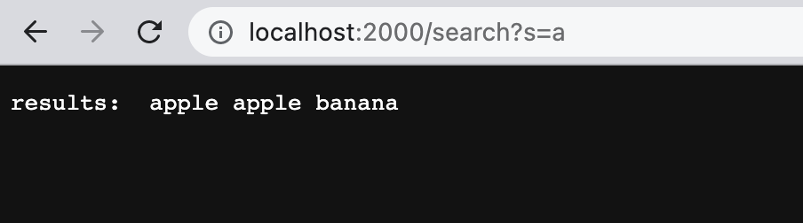
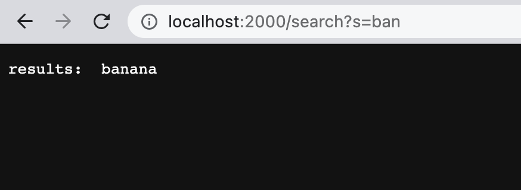
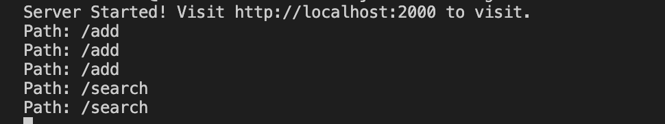

## **Hello! In this lab report we will cover...**
## Part 1 - the basics of a search engine implementation
## Part 2 - dealing with bugs via JUnit testing


---

# **Part 1: SearchEngine** 

- using the SearchEngine.java file, an integer value between 1024 and 49151 can be run along with the compiled file using the following commands
```
javac SearchEngine.java
java SearchEngine 2000
Server Started! Visit http://localhost:2000 to visit.
```
- the following output is observed which means that the server is now available to access at the following url (the number at the end depends on the input value that is passed as a parameter when running SearchEngine) http://localhost:2000
- our search engine contains 2 possible functionalities depending on whether the last part of the URL path is /add or /search
- /add will store in the server registry whatever query String is typed into the search bar after an = sign
- /search will search for all case sensitive occurences of the String after the = sign in the query
- here are some examples...

## After entering the URL, http://localhost:2000, use /add?s=String to add a search item to the registry; the query after = can be any String and is added once the page is refreshed

- url.getPath().contains("/add") and url.getQuery() are performed to add the query "apple"


***after refreshing***

- url.getPath().contains("/add") and url.getQuery() are performed to add the query "apple" once again

***adding "banana"***

- url.getPath().contains("/add") and url.getQuery() are performed to add the query "banana"

***now we can search for any words containing "a" by using http://localhost:2000/search?s=a***

- url.getPath().contains("/search") is used to identify the search functionality being called and url.getQuery().split("=") is used to split the query into the string before the = (stored at parameters[0]) and the string after the = (stored at parameters[1])
- the results contain all the words that contain "a" which are both the instances of "appple" and "banana" which were added

- if we instead search for "ban", we should expect to only get "banana" in our results...


***our expectation was correct***

- while all these queries were passed to the search bar, the command line looks like this...


- these lines show up in the terminal when a string is added or searched for because the SearchEngine.java file contains a URL handler that prints the URL path every time add or search is called
- the handler uses the following line to interpret the query portion of the URL (which is the string that is added to our search registry)
```
String[] parameters = url.getQuery().split("=");
//parameters[1] contains the String from the query that is either being added or searched for
```

## By using a URL handler and command line input which generates a port server, we are able to create this basic search engine by utilizing the query portion of URLs!

___


# **Part 2: Debugging**

## - **Bug 1: Array Reverse In Place**

```
public class ArrayTests{
    @Test
    public void test5NumReverseInPlace() {
        int[] input = {0, 1, 2, 3, 4};
        ArrayExamples.reverseInPlace(input);
        assertArrayEquals(new int[]{4, 3, 2, 1, 0}, input);
  }
}
```
The above input was given used in the JUnit test for the reverseInPlace() method. 
This 5 integer array does not properly reverse in place. The **symptom** is that the actual reversed input array = {4, 3, 2, 3, 4} because this assertArrayEquals fails. 

```
JUnit version 4.13.2
.E..
Time: 0.012
There was 1 failure:
1) test5NumReverseInPlace(ArrayTests)
arrays first differed at element [3]; expected:<1> but was:<3>
        at org.junit.internal.ComparisonCriteria.arrayEquals(ComparisonCriteria.java:78)
        at org.junit.internal.ComparisonCriteria.arrayEquals(ComparisonCriteria.java:28)
        at org.junit.Assert.internalArrayEquals(Assert.java:534)
        at org.junit.Assert.assertArrayEquals(Assert.java:418)
        at org.junit.Assert.assertArrayEquals(Assert.java:429)
        at ArrayTests.test5NumReverseInPlace(ArrayTests.java:23)
        ... 32 trimmed
Caused by: java.lang.AssertionError: expected:<1> but was:<3>
        at org.junit.Assert.fail(Assert.java:89)
        at org.junit.Assert.failNotEquals(Assert.java:835)
        at org.junit.Assert.assertEquals(Assert.java:120)
        at org.junit.Assert.assertEquals(Assert.java:146)
        at org.junit.internal.ExactComparisonCriteria.assertElementsEqual(ExactComparisonCriteria.java:8)
        at org.junit.internal.ComparisonCriteria.arrayEquals(ComparisonCriteria.java:76)
        ... 38 more

FAILURES!!!
Tests run: 3,  Failures: 1
```

The **bug** is that the ArrayExamples.java file's reverseInPlace() method doesn't hold the first half of the elements in temporary integer values. In other words, once the 0 index element is set to 4, there is no trace of the initial value of 0 since no temporary variable was used. The bug is the lack of a way to temporarily hold the first half of the input array while the values are being switched, and this bug causes the symptom (failure) since the 3rd element of the input array is still 3 even after reversing in place. 

```
public class ArrayExamples{
    static void reverseInPlace(int[] arr) {
        for(int i = 0; i < arr.length; i += 1) {
        arr[i] = arr[arr.length - i - 1]; //BUG: no way to reverse 2nd half of array
        }
        /* expected: 0 1 2 3 4
        actual: 4 3 2 3 4 BUG is that no temp variable for indexes that have been reversed */

    }
}  
```


## - **Bug 2: LinkedList Append**

```
public class LinkedListTests {
    @Test
    public void testAppend() {
        LinkedList linkedlist = new LinkedList();
        for(int i = 0; i < 10; i++) { linkedlist.append(i);  }
        assertEquals("0 1 2 3 4 5 6 7 8 9", linkedlist.toString()); //FAILS
    }
}
```
This LinkedList JUnit test attempts to append 10 input values (integers 0 through 9 in order) to the linked list and check if the LinkedList Node values match the output. The **symptom** is that the command line reports a JUnit failure: 
```
.E
Time: 140.079
There was 1 failure:
1) testAppend(LinkedListTests)
java.lang.OutOfMemoryError: Java heap space
        at LinkedList.append(LinkedListExample.java:43)
        at LinkedListTests.testAppend(LinkedListTests.java:10)

FAILURES!!!
Tests run: 1,  Failures: 1
```
The **bug** in the LinkedListExamples class is that the append() method contains an infinite while loop. Once the first node is added to the linkedlist, the following while loop exists in the LinkedListExamples class which never ends:
```
while(n.next != null) {
            n = n.next;
            n.next = new Node(value, null);
        }
```
In this case, the **bug** is that the current node, n, is set to the next node and then the following node is also given the new value. Since the n node traverses before assessing the presence of a null next value, the loop continues by infinitely adding the value to the linkedlist until the memory runs out of space and java throws the error (seen above). The connnection between the bug and the symptom is that the bug is the existence of the infinite while loop, which causes the symptom of the error being thrown due to memory being used up. To prevent the infinite loop, we need to check the (n.next != null) condition before moving on to the next iteration of the loop. This could be done by using a return statement if (n.next == null) inside the loop and not using the line in which the n.next node is set to a new Node.

