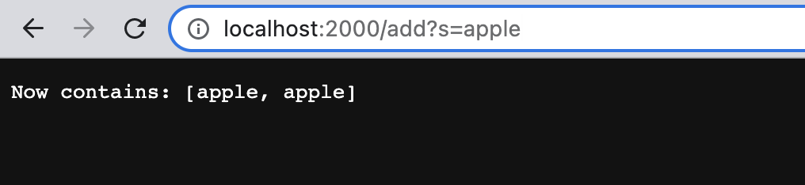

## **Hello! In this lab report we will cover...**
## Part 1 - the basics of a search engine implementation
## Part 2 - dealing with bugs via JUnit testing


---

## **Part 1: SearchEngine** 

- using the SearchEngine.java file, an integer value between 1024 and 49151 can be run along with the compiled file using the following commands
```
javac SearchEngine.java
java SearchEngine 2000
Server Started! Visit http://localhost:2000 to visit.
```
- the following output is observed which means that the server is now available to access at the following url (the number at the end depends on the input value that is passed as a parameter when running SearchEngine) http://localhost:2000
- our search engine contains 2 possible functionalities depending on whether the last part of the URL path is /add or /search
- /add will store in the server registry whatever query String is typed into the search bar after an = sign
- /search will search for all case sensitive occurences of the String after the = sign in the query
- here are some examples...

## After entering the URL, http://localhost:2000, use /add?s=String to add a search item to the registry; the query after = can be any String and is added once the page is refreshed

- url.getPath().contains("/add") and url.getQuery() are performed to add the query "apple"


***after refreshing***

- url.getPath().contains("/add") and url.getQuery() are performed to add the query "apple" once again

***adding "banana"***

- url.getPath().contains("/add") and url.getQuery() are performed to add the query "banana"

***now we can search for any words containing "a" by using http://localhost:2000/search?s=a***

- url.getPath().contains("/search") is used to identify the search functionality being called and url.getQuery().split("=") is used to split the query into the string before the = (stored at parameters[0]) and the string after the = (stored at parameters[1])
- the results contain all the words that contain "a" which are both the instances of "appple" and "banana" which were added

- if we instead search for "ban", we should expect to only get "banana" in our results...


***our expectation was correct***

- while all these queries were passed to the search bar, the command line looks like this...


- these lines show up in the terminal when a string is added or searched for because the SearchEngine.java file contains a URL handler that prints the URL path every time add or search is called
- the handler uses the following line to interpret the query portion of the URL (which is the string that is added to our search registry)
```
String[] parameters = url.getQuery().split("=");
//parameters[1] contains the String from the query that is either being added or searched for
```

## By using a URL handler and command line input which generates a port server, we are able to create this basic search engine by utilizing the query portion of URLs!
___

## **Part 2: Debugging**

