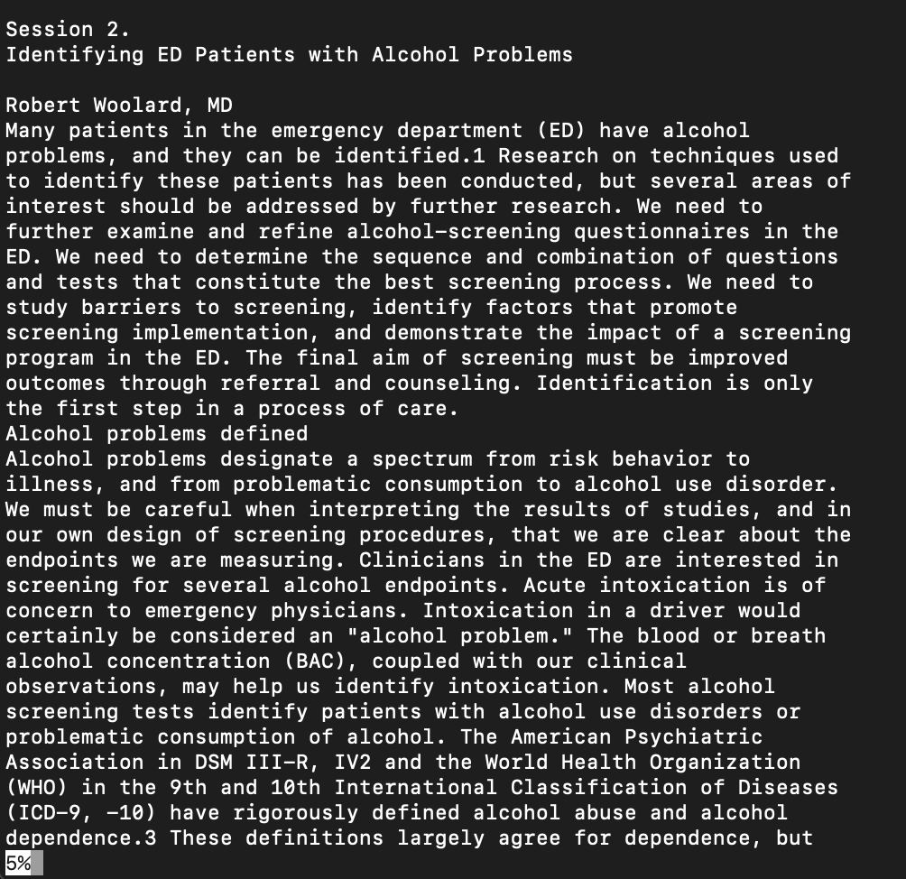

## **Hello! In this lab report we will be researching commands...**
## We will cover less, find, and grep commands

---

# less filename
- the less command essentially takes the file name argument and outputs all content of the chosen file one page at a time in the terminal window

```
//using directories from ./technical
less ./technical/biomed/rr74.txt //rr74.txt = file name
```
*output*

- this file can be traversed using the f key to go down and b to go up
- to exit the viewing of the file, press the q key
- this is useful for inspecting content of a specific file for general analysis as there is minimal information that makes it visually easy to pick out any specific information

## less -N filename
- using the -N option shows line numbers in the searched file
- this is useful when wanting to know where specific details of text are located inside a specific file

```
less -N ./technical/biomed/rr74.txt
```

*output*

- here, we can see in the viewing of the rr74.txt file we now have line numbers as a reference point when we scroll through the file
- this makes it easier to keep track of certain information and where it is found in the file for later access

## less -E filename
- this option exits the viewing of the file content as soon as the end of the file is reached 
- without the -E option, we cannot exit the file viewing unless we press the q key, so this option makes it more efficient to skim a file and return directly to the command line

```
less -E ./technical/biomed/rr172.txt
```
*output*

- after scrolling down all the way (either with scroll wheel or with f key) we no longer see the file content and are back at the terminal window

- this more efficient to see a file then return to the terminal for further commands without having to press the q key to exit

## less -m filename
- this option looks for the file matching the filename but also displays path of the file and percentage of the file that is above a certain window (like a progress bar for reading the file as you read through it)
- this is very helpful for in depth reading of a file to know the how far deep into the file content you are at any given point of time

```
less -m ./technical/government/Alcohol_Problems/Session2-PDF.txt 
```
*output*

- notice the 5% indicator at the bottom of the file content; this means we have traversed through 5% of the file content thus far
- having this progress percentage visible is helpful in assessing progress when reading through a file
- upon further scrolling, we will see this progress percentage increase (naturally)


# find filename
- the find command will search for all files that match the given filename argument
- this command is useful for visualizing a list of all files that contain a certain name or file type

```
//using directories from ./technical
find ./technical/biomed/*.txt //this searches for all files in the biomed directory of type .txt
```

*output*

- this is a small subset of all the .txt files in biomed that are found
- this output is useful for later filtering of specific files ending with .txt in biomed
- it is important for getting files containing a certain set of letters in the file name

## find -links N filename
- looks for files with N number of links
## find -print
- shows the path of the found files
## find empty
- looks for all empty files

# grep
- //add description
## grep -c
- shows the number of lines that matched the argument
## grep -l
- shows a list of all filenames that contain the argument being searched for
## grep -i
- isn't case sensitive in searching
