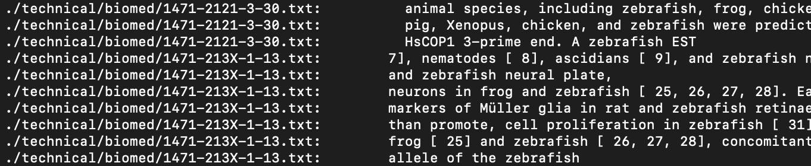

## **Hello! In this lab report we will be researching commands...**
## We will cover less, find, and grep commands

---

# less filename
- the less command essentially takes the file name argument and outputs all content of the chosen file one page at a time in the terminal window

```
# using directories from ./technical
# rr74.txt = file name
less ./technical/biomed/rr74.txt 
```
*output*

- this file can be traversed using the f key to go down and b to go up
- to exit the viewing of the file, press the q key
- this is useful for inspecting content of a specific file for general analysis as there is minimal information that makes it visually easy to pick out any specific information

## less -N filename
- using the -N option shows line numbers in the searched file
- this is useful when wanting to know where specific details of text are located inside a specific file

```
less -N ./technical/biomed/rr74.txt
```

*output*

- here, we can see in the viewing of the rr74.txt file we now have line numbers as a reference point when we scroll through the file
- this makes it easier to keep track of certain information and where it is found in the file for later access

## less -E filename
- this option exits the viewing of the file content as soon as the end of the file is reached 
- without the -E option, we cannot exit the file viewing unless we press the q key, so this option makes it more efficient to skim a file and return directly to the command line

```
less -E ./technical/biomed/rr172.txt
```
*output*

- after scrolling down all the way (either with scroll wheel or with f key) we no longer see the file content and are back at the terminal window

- this more efficient to see a file then return to the terminal for further commands without having to press the q key to exit

## less -m filename
- this option looks for the file matching the argument but also displays path of the file and percentage of the file that is above a certain window (like a progress bar for reading the file as you read through it)
- this is very helpful for in depth reading of a file to know the how far deep into the file content you are at any given point of time

```
less -m ./technical/government/Alcohol_Problems/Session2-PDF.txt 
```
*output*

- notice the 5% indicator at the bottom of the file content; this means we have traversed through 5% of the file content thus far
- having this progress percentage visible is helpful in assessing progress when reading through a file
- upon further scrolling, we will see this progress percentage increase (naturally)


# find filedirectory
- the find command will search for all files that match the given filedirectory argument
- this command is useful for visualizing a list of all files that contain a certain name or file type

```
# using directories from ./technical
find ./technical/biomed/*.txt # this searches for all files in the biomed directory of type .txt
```

*output*

- this is a small subset of all the .txt files in biomed that are found
- this output is useful for later filtering of specific files ending with .txt in biomed
- it is important for getting files containing a certain set of letters in the file name

## find -s filedirectory
- this command for all files matching the filedirectory  which is passed as the argument, BUT it also sorts the output in alphabetical/numerical order
- this is useful if the file names are intended to be sorted before being processed or analyzed

```
find -s ./technical/biomed/gb* 
# sorts all files in biomed directory that 
# contain "gb" in the name
```
*output*

- with the above output when the find -s command is run, it is apparent that the output of all the file names are sorted
- the output begins with file names containing 2000 after the "gb-" and then progressively increases to 2001, 2002, and so on 
- this option for the find command is especially useful to sort files by alphabetic order or by year of the file's publication (as seen in the above example)

## find directorypath -mindepth int
- this option of find shows all files in the given directory that have a minimum depth of the integer value passed in the argument
- this is very useful for determining tree structure of files and directories, especially when trying to determine how deep certain files are and the time complexity of accessing these files

```
find ./technical -mindepth 3
```
*output*

- here, it is evident that the files being displayed all have a minimum depth value of 3, because thery are nested 3 levels deeper than the ./technical directory path given in the argument
- this is useful if attempting to find all files within 2 other folders in the technical directory

## find directorypath -empty
- looks for all empty files within a certain directory
- this is useful if attempting to delete empty files after certain edits are made on a large scale
- by gathering all empty file names withiin a directory path, it is easier to weed through blank files and tighten up the directory by only keeping mandatory files!
```
find ./technical/biomed -empty
```
*output* 


- the output in this case is blank because there are no empty files in the biomed directory
- as such, we can use this command to check for empty files and since there are no empty files in biomed, we don't need to remove any blank files!

# grep "string" filedirectory
- the grep command searches for occurrences of the given "string" in the content of all files under the given filedirectory
- this is useful when attempting to search for a specific word/phrase/pattern in a file or directory of files

```
# to search for "pharmaceutical" in all txt 
#        files in the biomed directory
grep "pharmaceutical" ./technical/biomed/*.txt
```
*output*


- the output observed is the filepath of all txt files in the biomed folder that contain the string "pharmaceutical"
- this is very useful when working with a large amount of files and trying to parse through them by checking for relevant Strings such as words, sentences, or phrases

## grep -n "String" filedirectory
- this shows the line numbers of the occurrences that matched the argument string
- this is useful for assessing relative location of a phrase within multiple files because it could provide useful information about where in the file a certain detail exists!

```
grep -n "biologically" ./technical/biomed/*
```

*output*


- evidently, this option of grep provided us with the line numbers (right next to the file path) where the String was found
- this is useful in the event that we are trying to determine how deep into a file a certain string occurs, or specifically where in the file the specified string is found

## grep -w "String" filedirectory
- this option displays all occurrences of the exact String as a word in the given file path
- this is useful when searching for a specific word or string and not a larger phrase that contains these same letters
- for example, the following command searches for a string in the plos directory

```
grep -w "look" ./technical/plos/*
```

- this command will look for all occurences of the word "look" excluding larger words that contain this String
- in other words, "looking" or "looks" won't be outputted to the terminal
- grep -w is useful for finding specific words (not contained in larger strings) such as smaller words/phrases that normally found in many large words/sentences

*output*


## grep -i "STRING" filedirectory
- this option is not case sensitive when searching for the given string in the file directory

```
grep -i "ZEbRAFiSH" ./technical/biomed/* 
```

*output*



- this example shows how the -i option turns off case sensitivity and returns all occurences of "zebrafish" to the terminal (many of which are completely lowercase)
- this is useful for searching for terms that can either be capital if found at the start or middle of a sentence because they would be capitalized differently depending on the location

