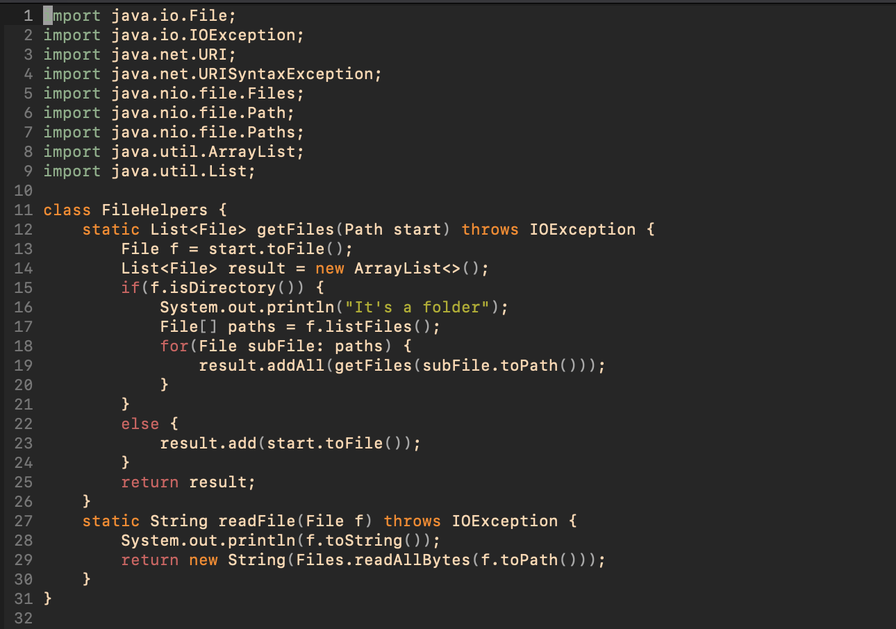
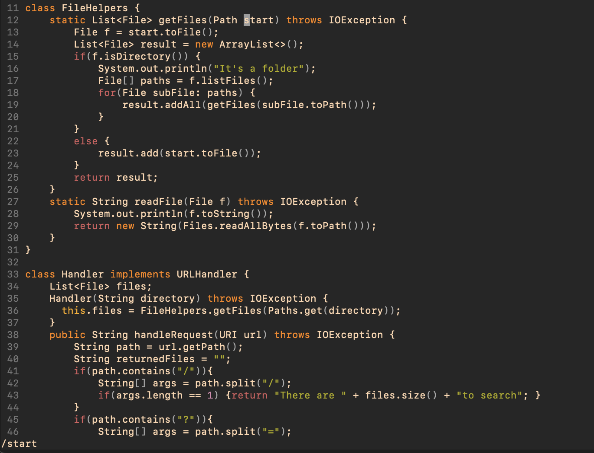
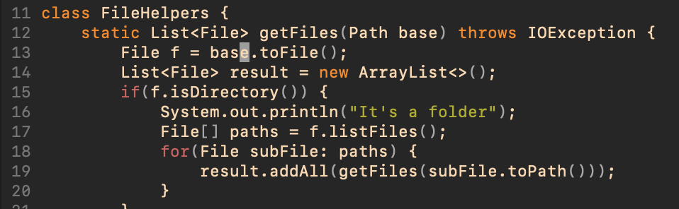
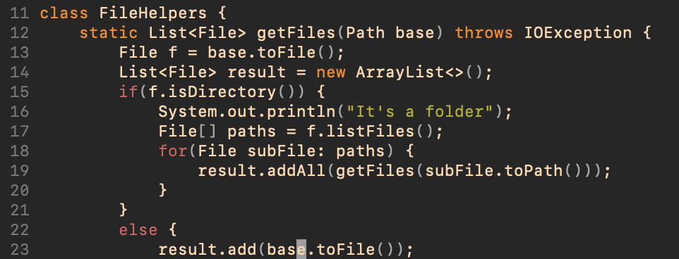

## **Hello! In this lab report we will discuss examples of optimizing file editing with vim commands...**

- **Vim commands to replace phrases**

- first, we will look at an efficient way to replace certain strings in a file/method with a new string
- in the DocSearchServer.java we will replace all instances of the word "start" with "base" in the getFiles() method
- once we open the file with the following command, we will get the file view in vim

```
vim DocSearchServer.java
```



- in order to swap all the instances of "start" with "base" in the getFiles() method, we use the following characters

**/start<Enter>cebase<ESC>n.n.:wq**

- let's break down each command and the effect on the file



**/start**
- the /start command searches for instances of the word "start" in the file (shown by the highlighted text)


**cebase<ESC>**
- the ce command clears the current word "start" and enters insert mode
- now that we are in insert mode, we can simply type "base" to add the new string
- pressing <ESC> escapes insert mode so that we can soon transition to subsequent instances of "start"


- after pressing "n." once

- after pressing"n." a second time

**n.n.**
- each "n" will move to the next instance of "start" and then each "." will perform the same process as before without having to repeat cebase<ESC>


**:wq**
- lastly, the :w will save the edits and q quits the file


