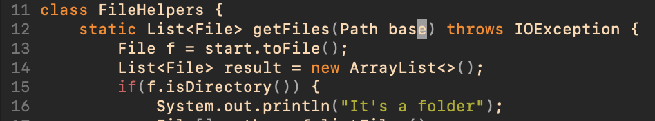

## **Hello! In this lab report we will discuss examples of optimizing file editing with vim commands...**

- **Part 1: Vim commands to replace phrases**

- first, we will look at an efficient way to replace certain strings in a file/method with a new string
- in the DocSearchServer.java we will replace all instances of the word "start" with "base" in the getFiles() method
- once we open the file with the following command, we will get the file view in vim

```
vim DocSearchServer.java
```


- in order to swap all the instances of "start" with "base" in the getFiles() method, we use the following characters

**21 keys to make this change**
```
/start<Enter>cebase<ESC>n.n.:wq
```

- let's break down each command and the effect on the file


**/start**
- the /start command searches for instances of the word "start" in the file (shown by the highlighted text)



**cebase<ESC>**
- the ce command clears the current word "start" and enters insert mode
- now that we are in insert mode, we can simply type "base" to add the new string
- pressing <ESC> escapes insert mode so that we can soon transition to subsequent instances of "start"


- after pressing "n." once

- after pressing"n." a second time

**n.n.**
- each "n" will move to the next instance of "start" and then each "." will perform the same process as before without having to repeat cebase<ESC>


**:wq**
- lastly, the :w will save the edits and q quits the file
- while :w and :q can be typed separately since they are 2 different commands, combination of the two commands is easy and efficient


- **Part 2: SCP Local edits vs Vim on a Remote Server**
- we will now be comparing the efficiency of making the same edit made in part 1 in different ways...
1. making a local edit on VS Code and SCP-ing the file to a server
2. making the same edit to a file using Vim on the remote server

1. local edit then SCP
    - this process took approximately **100 seconds** to complets
    - first, the file is editted locally with VS Code 
    - then, the file is run locally after the edit (bash test.sh)
    - then, only the editted file is scp-ed to the remote ieng server
    ```
    scp DocSearchServer.java cs15lfa22ps@ieng6.ucsd.edu:~/skill-demo1
    ssh cs15lfa22ps@ieng6.ucsd.edu
    # once in remote serever
    cd skill-demo1
    bash test.sh
    ```
    - the ssh command is used to log into the remote server, on which the bash test file is run

2. remote edits using vim on server
    - this process took approximately **80 seconds** to complete
    - this entailed first logging into the ieng6 server and cloning the repository onto the remote environment
    - then, vim is used to edit the DocSearchServer.java and make the same edits as part 1 (replacing "start" with "base")
    - finally, the test.sh file is run with bash test.sh

- Some difficulties that came up in method 1 were waiting for the scp to occur, which was completely avoided in method 2. Also, method 1 involved more overall keys needing to be pressed since the logic behind it took more steps
- Overall, I would prefer cloning the repository directly into the remote server and editting the files remotely since it prevents the need to move files around and worry about which directory contains the updated version of the file. Method 2, doing remote edits using vim on the server seemed to work faster for me. 

Some aspects of a project that would affect my decision to edit locally or remotely...
- the volume of files that are editted/altered; more file edits would make the argument to edit remotely even stronger since there is no worry about scp-ing the files
- how complex the edits are; if edits require more testing or work, I would rather edit locally first on VS Code before uploading to the server
- who has access to the remote server; if multiple people will be using the file on the remote server, I would edit locally until the file is effective then scp it to the server so other collaborators wouldn't be working with a possibly incomplete/buggy file

