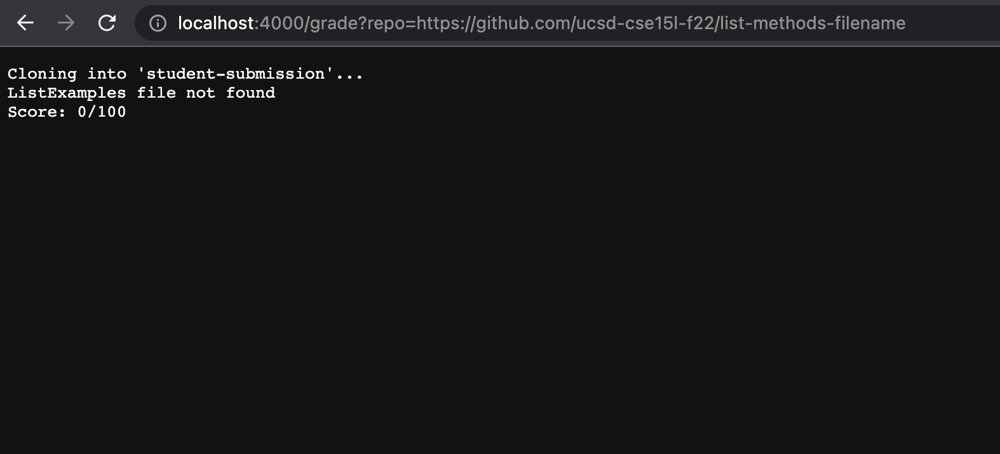
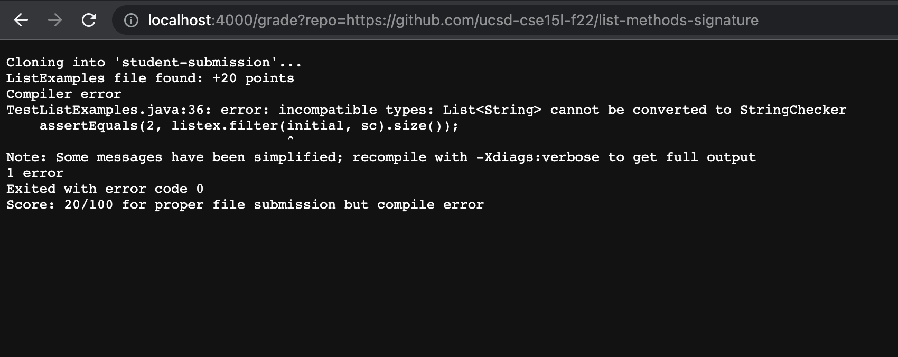
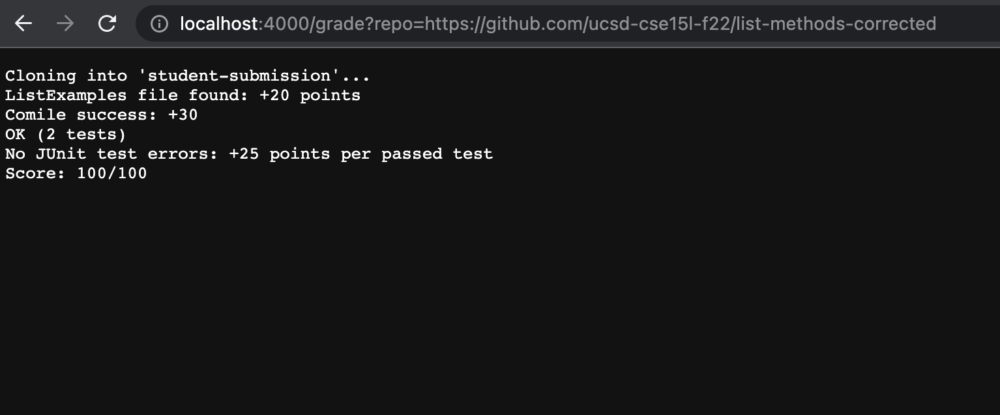
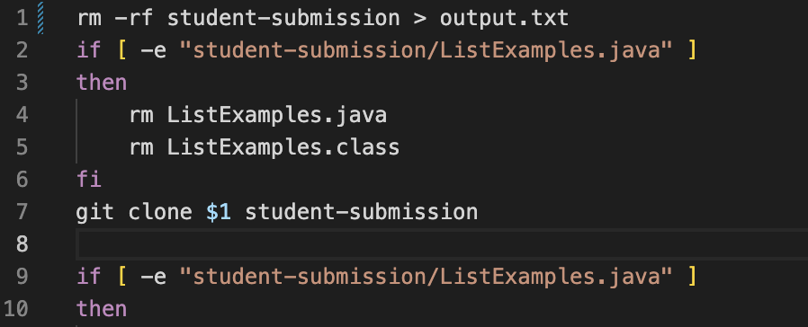
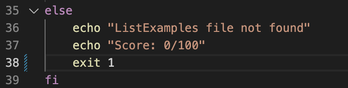

## **Hello! In this lab report we will discuss a bash file that can be used to test student submissions of a ListExamples.java file**


- **First, we will take a look at the grade.sh bash script that we will use to score student submissions...**

```
#grade.sh file used to grade student submissions

rm -rf student-submission
if [ -e "student-submission/ListExamples.java" ]
then
	rm ListExamples.java
	rm ListExamples.class
fi
git clone $1 student-submission

if [ -e "student-submission/ListExamples.java" ]
then
	echo "ListExamples file found: +20 points"
	cp student-submission/ListExamples.java ./
	javac -cp .:lib/hamcrest-core-1.3.jar:lib/junit-4.13.2.jar *.java 2> error.txt
	if [ -s error.txt ]
	then
		echo "Compiler error"
		echo "$(cat error.txt)"
		echo "Exited with error code $?"
		echo "Score: 20/100 for proper file submission but compile error"
		exit 1
	else
		echo "Comile success: +30"
		java -cp .:lib/hamcrest-core-1.3.jar:lib/junit-4.13.2.jar org.junit.runner.JUnitCore TestListExamples > output.txt
		if grep "OK (2 tests)" $"output.txt"
		then
		  echo "No JUnit test errors: +25 points per passed test"
		  echo "Score: 100/100"
		  exit 0
		else
		  echo "JUnit test errors"
		  echo "$(cat output.txt | tail -n2)"
		  exit 1
		fi
	fi
else
	echo "ListExamples file not found"
	echo "Score: 0/100"
	exit
fi

```

## **We will now take a look at what this grader script can do when given repositories of student submissions; specifically, we will look at the output for submissions with incorrect file name, syntax errors, or proper functionality.**

- Incorrect file name (0%) (https://github.com/ucsd-cse15l-f22/list-methods-filename)



- Syntax errors (20%) (https://github.com/ucsd-cse15l-f22/list-methods-signature)



- Proper functionality (100%) (https://github.com/ucsd-cse15l-f22/list-methods-corrected)




----
----
### Basically, the grade script is giving points as follows...
- 0 points if the file ListExamples.java is not located 
- 20 points if the file is submitted but doesn't compile 
- 50 points if the right file is submitted and compiles
- 25 points for passing each of the 2 JUnit Tests that test the merge() and filter() methods in ListExamples.java

**for a total of 100 points**

-----

## Tracing the Script for the Wrong File Submission


- Lines 1-6 are involved with removing the directory and all have a zero exit code. The if block will only execute if there is a previously graded student submission sitting in the directory. (In this case the if statement was true).
- Line 7 will clone the student repository from either the query (if loaded on a browser) or from the first argument in the command line. The exit code is 1 and there is no output other than "Cloning into 'student-submission'..."
- Line 9's if block will not execute since the student submission we are tracing has the wrong file name so this condition is false. The exit code is nonzero. The standard output and error are both blank for this line.


- Now we jump to Line 35 which begins the else component of the if block
- Line 36 will have standard output that "ListExamples file not found" and will have an exit code of 0. There is no standard error.
- Line 37 will have a standard output of "Score: 0/100" and an exit code of 0. It also has no standard error.
- Line 38 has no standard error or standard output, and simply exits with the nonzero exit code of 1.


